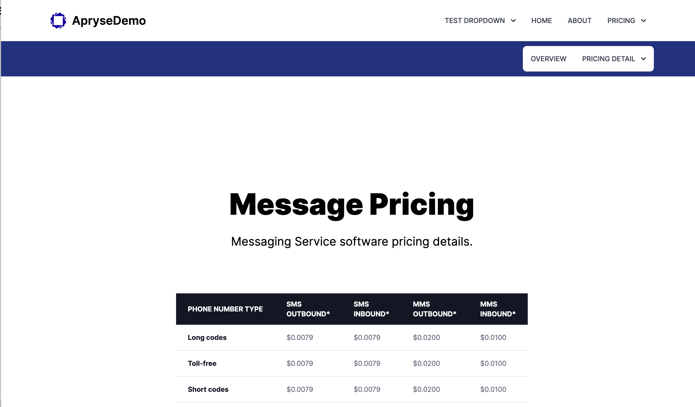
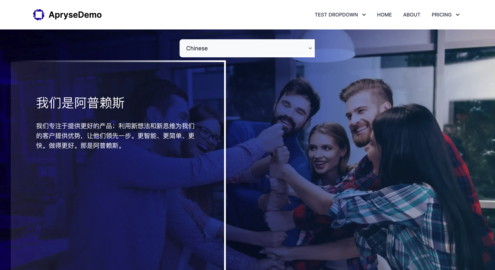

### A Next + Sanity CMS demo project (Client side)

This project fetches data and creates the demo page and nav bars from Sanity dynamically. Also **Localization** is implemented in the demo about page.




## Getting Started

First, run the development server:

```bash
npm run dev
```

Open [http://localhost:3000](http://localhost:3000) with your browser to see the result.

